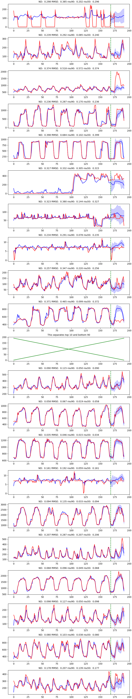

# List of Implementations:
Currently, the reimplementation of the DeepAR paper(DeepAR: Probabilistic Forecasting with Autoregressive Recurrent Networks https://arxiv.org/abs/1704.04110) is available in PyTorch. More papers will be coming soon.

## Authors:
* **Yunkai Zhang**(<yunkai_zhang@ucsb.edu>) - *University of California, Santa Barbara* 

* **Qiao Jiang** - *Brown University*

* **Xueying Ma** - *Columbia University*
* Acknowledgement: Professor Xifeng Yan's group at UC Santa Barbara. Part of the work was done at WeWork.

## To run:


1. Install all dependencies listed in requirements.txt. Note that the model has only been tested in the versions shown in the text file.

1. Download the dataset and preprocess the data:
  
   ```bash
   python preprocess_elect.py
   ```
1. Start training:
  
   ```bash
   python train.py
   ```
   
   - If you want to perform ancestral sampling,
   
        ```bash
        python train.py --sampling
        ```
   - If you do not want to do normalization during evaluation,
              
   
        ```bash
        python train.py --relative-metrics
        ```
1. Evaluate a set of saved model weights:
        
   ```bash
   python evaluate.py
   ```
1. Perform hyperparameter search:
        
   ```bash
    python search_params.py
   ```

## Results

​	The model is evaluated on the electricity dataset, which contains the electricity consumption of 370 households from 2011 to 2014. Under hourly frequency, we use the first week of September, 2014 as the test set and all time steps prior to that as the train set. Following the experiment design in DeepAR, the window size is chosen to be 192, where the last 24 is the forecasting horizon. History (number of time steps since the beginning of each household), month of the year, day of the week, and hour of the day are used as time covariates. Notice that some households started at different times, so we only use windows that contain non-missing values.

​	Under Gaussian likelihood, we use the Adam optimizer with early stopping to train the model for 20 epoches. The same set of hyperparameters is used as outlined in the paper. Weights with the best ND value is selected, where __ND = 0.06349__, RMSE = 0.452, rou90 = 0.034 and rou50 = 0.063.

​	Sample results on electricity. The top 10 plots are sampled from the test set with the highest 10% ND values, whereas the bottom 10 plots are sampled from the rest of the test set.



